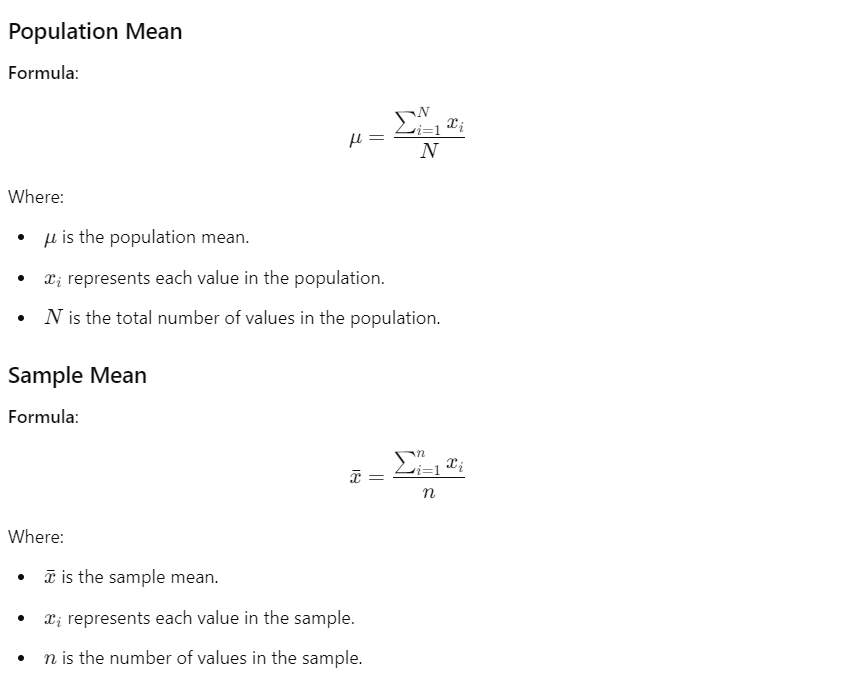

## Topics to Cover

**Descriptive Statistics vs. Inferential Statistics**

**Descriptive statistics**: Summarizing data (e.g., measures of central tendency, measures of dispersion, histograms, box plots).

**Inferential statistics**: Making predictions or inferences about a population based on a sample (e.g., z-test, t-test, ANOVA, chi-square test).

1. **Descriptive Statistics**

   - Measures of Central Tendency
     - Mean
     - Median
     - Mode
   - Measures of Dispersion
     - Variance
     - Standard Deviation
     - Range
   - Data Summarization Tools
     - Histograms
     - Box Plots
     - Whisker Plots
   - Probability Distributions
     - Probability Density Function (PDF)
     - Cumulative Distribution Function (CDF)
     - Gaussian Distribution
     - Log Normal Distribution
     - Binomial Distribution
     - Bernoulli Distribution
     - Pareto Distribution (Power Law Distribution)
     - Standard Normal Distribution
   - Statistical Transformation Techniques
     - Standardization
     - Q-Q Plot Analysis

- **Inferential Statistics**

  - Hypothesis Testing
    - Null Hypothesis
    - Alternative Hypothesis
  - Statistical Tests
    - Z-test
    - T-test
    - ANOVA (Analysis of Variance)
      - F-test
      - Factorial ANOVA
    - Chi-square test
  - P-values
  - Confidence Intervals
  - Statistical Tables
    - Z-tables
    - T-tables
    - Chi-square tables
- **Sampling Techniques**

  - Simple Random Sampling
  - Stratified Sampling
  - Systematic Sampling
  - Convenience Sampling
- **Applications and Examples**

  - Exit Poll Analysis
  - Household Surveys
  - Drug Testing Sampling Strategies

1. **Basic Definitions**
   - Statistics: The science of collecting, organizing, and analyzing data to make better decisions.
   - Data: Facts or pieces of information that can be measured.
   - Types of Statistics: Descriptive (organizing and summarizing data) and Inferential (using data to form conclusions).

## Key Concepts and Examples

### Descriptive Statistics

- Example: Calculating the average age of students in a class.
- Measures: Central tendency (mean, median, mode), dispersion (variance, standard deviation), data visualization (histograms, box plots).

### Inferential Statistics

- Example: Determining if the average marks of students in one classroom are similar to the average marks of students in the entire college.
- Techniques: Using sample data to make inferences about a population, hypothesis testing, confidence intervals.

### Population and Sample

- Population: The entire group being studied, denoted by \( N \).
- Sample: A subset of the population, denoted by \( n \).
- Example: Conducting an exit poll by surveying a sample of voters to infer the preferences of the entire population.

## Sampling Techniques

1. **Simple Random Sampling**

   - Definition: Every member of the population has an equal chance of being selected.
   - Example: Randomly selecting individuals for a survey.
2. **Stratified Sampling**

   - Definition: The population is divided into non-overlapping groups (strata) and samples are taken from each group.
   - Example: Sampling based on gender (male, female) or age groups.
3. **Systematic Sampling**

   - Definition: Selecting every nth individual from the population.
   - Example: Surveying every 8th person entering a mall.
4. **Convenient Sampling**

   - Definition: Sampling individuals who are conveniently available.
   - Example: Surveying individuals who have expertise in a specific topic like data science.

## Practical Applications

- **Election Polls**: Using random sampling to predict election results.
- **Household Surveys**: RBI using stratified or random sampling for surveys.
- **Drug Testing**: Using stratified sampling based on age groups for testing new drugs.

## Conclusion

Understanding both descriptive and inferential statistics is crucial for making informed decisions based on data. Using various sampling techniques ensures that the data collected is representative and reliable. Throughout this course, we will dive deep into these concepts and apply them using Python, enabling you to tackle real-world data science problems efficiently. Let's start our journey by understanding the fundamental concepts of statistics!

## Variables

### What is a Variable?

A variable is a property that can take on any value. For example, height and weight are variables. They can have values like 170 cm, 172 cm, 185 cm, 190 cm for height and values like 78 kg, 99 kg, 100 kg, 60 kg, 50 kg for weight.

### Types of Variables

There are two kinds of variables:

1. **Quantitative Variables**
2. **Qualitative (Categorical) Variables**

#### Quantitative Variables

Quantitative variables can be measured numerically. We can perform various operations like addition, subtraction, division, and multiplication on them. Examples include:

- Age
- Weight
- Height

Quantitative variables can be further divided into two types:

1. **Discrete Variables:** These can only take whole numbers.

   - Examples: Number of bank accounts, number of children in a family.
2. **Continuous Variables:** These can take any numerical value.

   - Examples: Height, weight, amount of rainfall.

#### Qualitative (Categorical) Variables

Qualitative variables are based on characteristics and cannot be measured numerically. We cannot perform mathematical operations on them. Examples include:

- Gender (male, female)
- IQ categories (0-10: less IQ, 10-50: medium IQ, 50-100: good IQ)
- Blood group (A positive, A negative)
- T-shirt size (large, XL, medium, small)

### Examples of Variable Types

- **Gender:** Qualitative or categorical
- **Marital Status:** Qualitative or categorical
- **River Length:** Quantitative (continuous)
- **Population of a State:** Quantitative (discrete)
- **Song Length:** Quantitative (continuous)
- **Blood Pressure:** Quantitative (continuous)
- **Pin Code:** Discrete or categorical

Understanding the types of variables is crucial for handling them appropriately in data science problems.

### Variable Measurement

We have four different types of measured variables:

1. **Nominal**
2. **Ordinal**
3. **Interval**
4. **Ratio**

Understanding these types is crucial because your dataset will contain these variables, enabling you to perform effective data analysis. Let’s explore each type:

#### Nominal

Nominal data, also known as categorical or qualitative data, is divided into different classes. Examples include:

- Colors
- Gender
- Types of flowers

This type of data is used to label variables without providing any quantitative value.

#### Ordinal

In ordinal data, the order of values matters, but the specific value does not. For instance:

- Students' marks: 100, 96, 57, 85, 44
  - Ranks: 1st, 2nd, 3rd, 4th, 5th

Here, the focus is on the order (ranks) rather than the actual values (marks).

#### Interval

Interval data has meaningful order and values, but lacks a true zero. For example:

- Temperature in Fahrenheit: 70-80°F, 80-90°F
- Distance ranges: 10-20 miles, 20-30 miles

Zero Fahrenheit does not signify the absence of temperature.

#### Ratio

Ratio data has all the properties of interval data, but with a meaningful zero point, indicating the absence of the variable being measured. This means you can make meaningful statements about how many times greater one object is compared to another. Examples include:

- **Height:** Zero height means the absence of height.
- **Weight:** Zero weight means the absence of weight.
- **Income:** Zero income means no income.
- **Distance:** Zero distance means no distance traveled.

### Examples and Analysis

#### Height

- **Data:** 150 cm, 160 cm, 170 cm, 180 cm, 190 cm
- **Properties:**
  - Order matters: 150 cm < 160 cm < 170 cm < 180 cm < 190 cm
  - Value matters: The difference between 150 cm and 160 cm is the same as between 180 cm and 190 cm.
  - True zero: A height of 0 cm indicates no height.

#### Weight

- **Data:** 50 kg, 60 kg, 70 kg, 80 kg, 90 kg
- **Properties:**
  - Order matters: 50 kg < 60 kg < 70 kg < 80 kg < 90 kg
  - Value matters: The difference between 50 kg and 60 kg is the same as between 80 kg and 90 kg.
  - True zero: A weight of 0 kg indicates no weight.

#### Income

- **Data:** $30,000, $40,000, $50,000, $60,000, $70,000
- **Properties:**
  - Order matters: $30,000 < $40,000 < $50,000 < $60,000 < $70,000
  - Value matters: The difference between $30,000 and $40,000 is the same as between $60,000 and $70,000.
  - True zero: An income of $0 indicates no income.

#### Distance

- **Data:** 10 km, 20 km, 30 km, 40 km, 50 km
- **Properties:**
  - Order matters: 10 km < 20 km < 30 km < 40 km < 50 km
  - Value matters: The difference between 10 km and 20 km is the same as between 40 km and 50 km.
  - True zero: A distance of 0 km indicates no distance traveled.

### Key Points

- **Order Matters:** Like ordinal and interval data, the order of values in ratio data is meaningful.
- **Value Matters:** The difference between values is consistent and meaningful.
- **True Zero:** Unlike interval data, ratio data has a true zero, making statements like "twice as much" meaningful.

Understanding the type of data you're working with is crucial for selecting appropriate statistical methods and analyses. Ratio data allows for a wide range of statistical techniques, including all those applicable to interval data, plus additional operations such as meaningful ratios and percentages.

### Frequency Distribution

Understanding frequency distribution is essential for visualizing datasets. Let’s consider a dataset with three types of flowers: Rose, Lily, and Sunflower.

```
Rose, Lily, Sunflower, Rose, Lily, Lily, Lily
```

Creating a frequency distribution table:

| Flower    | Frequency |
| ----------- | ----------- |
| Rose      | 3         |
| Lily      | 4         |
| Sunflower | 2         |

#### Cumulative Frequency

Cumulative frequency sums the frequencies sequentially:

- Rose: 3
- Rose + Lily: 3 + 4 = 7
- Rose + Lily + Sunflower: 3 + 4 + 2 = 9

### Visualizing Data

Using frequency distribution, we can derive bar charts, pie charts, etc.

#### Bar Graph

For discrete variables, we use bar graphs. Example:

- **X-axis:** Flower types (Rose, Lily, Sunflower)
- **Y-axis:** Frequency

```plaintext
Rose:      ###
Lily:      ####
Sunflower: ##
```

#### Histogram

For continuous variables, we use histograms. Example with ages:

- Ages: 10, 12, 14, 18, 24, 26, 30, 35, 36, 37, 40, 41, 42, 43, 50, 51

Bins (default size 10):

- 0-10: 0
- 10-20: 4 (10, 12, 14, 18)
- 20-30: 3 (24, 26, 30)
- 30-40: 4 (35, 36, 37, 40)
- 40-50: 4 (41, 42, 43, 50)
- 50-60: 1 (51)

```plaintext
10-20: ####
20-30: ###
30-40: ####
40-50: ####
50-60: #
```

#### Probability Density Function (PDF)

PDF is the smoothening of a histogram using a Kernel Density Estimator (KDE). It’s an advanced topic we’ll cover later.

### Bar Graph vs Histogram

- **Bar Graph:** Used for discrete data
- **Histogram:** Used for continuous data

A probability density function (PDF) smoothens histograms for continuous data representation.

Sure, let's break down the topics covered in your session and prepare a more structured version.

---

# Statistics for Data Science: Intermediate Level

## Overview

In this session, we will cover intermediate statistical concepts crucial for data science. Specifically, we will delve into:

1. Measure of Central Tendency
2. Measure of Dispersions
3. Gaussian Distribution
4. Z Score
5. Standard Normal Distribution

## 1. Measure of Central Tendency

### Definition

It refers to the measure used to determine the central part of the distribution of the data

### Arithmetic Mean (Average)

**Definition**: The mean is the sum of all values divided by the number of values.

#### Formulas

 

- **Population Mean (μ)**:
  $$
  \mu = \frac{\sum_{i=1}^{N} x_i}{N}
  $$
  Where \( N \) is the total number of values in the population.
- **Sample Mean ( \( \bar{x} \) )**:
  $$
  \bar{x} = \frac{\sum_{i=1}^{n} x_i}{n}
  $$
  Where \( n \) is the number of values in the sample.

**Example**:
Given the dataset: \( 3, 3, 4, 5, 5, 6\} \)

- Sum of values: \( 3 + 3 + 4 + 5 + 5 + 6 = 26 \)
- Number of values: 6
- Mean: \( \frac{26}{6} = 4.33 \)

### Median

**Definition**: The median is the middle value in a dataset when arranged in ascending order. If the number of values is even, it is the average of the two middle numbers.

**Example**:
Given the dataset: \( $$1, 1, 2, 2, 3, 3, 4, 5, 5, 6\} \)

- Median: \( 3 \)

If an outlier (e.g., 100) is added: \( $$1, 1, 2, 2, 3, 3, 4, 5, 5, 6, 100\} \)

- Median: \( \frac{3 + 4}{2} = 3.5 \)

### Mode

**Definition**: The mode is the value that appears most frequently in a dataset.

**Example**:
Given the dataset: \( $$1, 2, 2, 3, 4, 5, 6, 6, 6, 7, 8\} \)

- Mode: \( 6 \)

**Usage**:
Mode is often used for categorical data. For instance, in a dataset of flower types, the mode would be the flower type that appears most frequently.

## 2. Measure of Dispersions

### Range, Variance, and Standard Deviation

These concepts measure the spread or variability of the dataset.

### Example

Given the dataset: \( $$1, 2, 2, 3, 4, 5, 6\} \)

- Range: \( 6 - 1 = 5 \)
- Variance and standard deviation calculations can be performed using appropriate formulas or software tools.

## 3. Gaussian Distribution (Normal Distribution)

### Definition

A continuous probability distribution characterized by a bell-shaped curve, symmetric about the mean.

### Properties

- Mean $\mu$
- Standard deviation $\sigma$

## 4. Z Score

### Definition

A measure of how many standard deviations an element is from the mean.

### Formula

<!-- $\frac123$ -->

$$
Z = \frac{(X - \mu)}{\sigma}
$$

## 5. Standard Normal Distribution

### Definition

A normal distribution with a mean of 0 and a standard deviation of 1.

### Conversion

Any normal distribution can be converted to a standard normal distribution using the Z-score formula.

---

These are the core topics for today's session. We will dive deeper into each concept, solve problems, and understand their applications in data science. Feel free to ask questions as we progress through each section.

### Population Mean

**Formula**:
$$
\mu = \frac{\sum_{i=1}^{N} x_i}{N}
$$
Where:

- $\mu$ is the population mean.
- $x_i$ represents each value in the population.
- N is the total number of values in the population.

### Sample Mean

**Formula**:

$$ \bar{x} = \frac{\sum_{i=1}^{n} x_i}{n}
$$
Where:

- \(\bar{x}\) is the sample mean.
- \(x_i\) represents each value in the sample.
- \(n\) is the number of values in the sample.

These formulas allow you to calculate the average value of a dataset, whether you are dealing with the entire population or just a sample from that population.

### Measures of Dispersion: Variance and Standard Deviation

Measures of dispersion help us understand the spread or variability of a dataset. The two primary measures we will discuss are **variance** and **standard deviation**.

#### Variance

Variance measures the average degree to which each point differs from the mean. It gives us an idea of how spread out the data points are. There are two types of variance: population variance and sample variance.

- **Population Variance $\sigma^2$)**:
  $$
  \sigma^2 = \frac{\sum_{i=1}^N (x_i - \mu)^2}{N}
  $$
  Where N is the total number of observations, $x_i$ are the individual data points, and $\mu$ is the population mean.
- **Sample Variance $s^2$**:
  $$
  s^2 = \frac{\sum_{i=1}^n (x_i - \bar{x})^2}{n - 1}
  $$
  Where n is the number of sample observations, $x_i$ are the individual data points, and
  $\bar{x}$ is the sample mean.

  The use of n-1 instead of n is known as Bessel's correction, which corrects the bias in the estimation of the population variance from a sample.

#### Standard Deviation

Standard deviation is the square root of the variance, providing a measure of dispersion in the same units as the original data, which makes it more interpretable.

- **Population Standard Deviation ($\sigma$)**:
  $$
  \sigma = \sqrt{\sigma^2} = \sqrt{\frac{\sum_{i=1}^N (x_i - \mu)^2}{N}}
  $$
- **Sample Standard Deviation $s$**:
  
  $$
  s = \sqrt{s^2} = \sqrt{\frac{\sum_{i=1}^n (x_i - \bar{x})^2}{n - 1}}
  $$

### Example Calculation

Let's consider a dataset: 1, 2, 2, 3, 4, 5

1. **Calculate the Mean ($\bar{x}$)**:
   $$
   \bar{x} = \frac{1 + 2 + 2 + 3 + 4 + 5}{6} = 2.83
   $$
2. **Calculate $x_i - \bar{x}$ for each data point**:
   $$
   \begin{align*}
   1 - 2.83 &= -1.83 \\
   2 - 2.83 &= -0.83 \\
   2 - 2.83 &= -0.83 \\
   3 - 2.83 &= 0.17 \\
   4 - 2.83 &= 1.17 \\
   5 - 2.83 &= 2.17 \\
   \end{align*}
   $$
3. **Square each result**:
   $$
   \begin{align*}
   (-1.83)^2 &= 3.35 \\
   (-0.83)^2 &= 0.69 \\
   (-0.83)^2 &= 0.69 \\
   0.17^2 &= 0.03 \\
   1.17^2 &= 1.37 \\
   2.17^2 &= 4.71 \\
   \end{align*}
   $$
4. **Sum of squared differences**:
   $$
   3.35 + 0.69 + 0.69 + 0.03 + 1.37 + 4.71 = 10.84
   $$
5. **Calculate the Sample Variance**:
   $$
   s^2 = \frac{10.84}{6 - 1} = \frac{10.84}{5} = 2.168
   $$
6. **Calculate the Sample Standard Deviation**:
   $$
   s = \sqrt{2.168} \approx 1.47
   $$

### Interpretation

- **Variance**: A higher variance indicates that the data points are more spread out from the mean, while a lower variance indicates that they are closer to the mean.
- **Standard Deviation**: This gives a more intuitive sense of dispersion. For example, in the above dataset, the standard deviation of approximately 1.47 suggests that most data points lie within 1.47 units of the mean (2.83).

By understanding and calculating these measures of dispersion, we can better interpret the variability and spread of data in various contexts.

## Understanding Percentiles and Quartiles to Identify Outliers

### Basics of Percentiles

To begin, let’s first understand the concept of percentiles. Before diving into percentiles, it's essential to grasp the idea of percentages. Suppose we have a small dataset: `[1, 2, 3, 4, 5]`. If we want to find the percentage of numbers that are odd, we can use the formula:

$$ \text{Percentage} = \left(\frac{\text{Number of odd numbers}}{\text{Total number of numbers}}\right) \times 100 $$

In this case, there are 3 odd numbers (1, 3, 5) out of 5. So,

$$ \text{Percentage} = \left(\frac{3}{5}\right) \times 100 = 60\% $$

### Defining Percentiles

Percentiles, on the other hand, are a bit more specific. A percentile is a value below which a certain percentage of observations fall. For example, if we say a value is at the 25th percentile, it means 25% of the data is below that value.

#### Formula for Percentile Rank

To find the perce ntile rank of a given value `X` in a dataset, we use:

$$ \text{Percentile rank} = \left(\frac{\text{Number of values below } X}{\text{Total number of values}}\right) \times 100 $$

Consider the dataset `[2, 2, 3, 4, 5, 5, 6, 7, 8, 8, 9, 9, 10, 11, 11, 12]`. To find the percentile rank of 10:

1. Count the number of values below 10: 13
2. Total number of values: 16
3. Apply the formula:

$$ \text{Percentile rank of 10} = \left(\frac{13}{16}\right) \times 100 = 81.25 $$

Thus, 10 is at the 81.25th percentile, meaning 81.25% of the values are less than 10.

### Finding the Value at a Given Percentile

To find the value at a given percentile (e.g., 25th percentile):

$$ \text{Index} = \left(\frac{\text{Percentile}}{100}\right) \times (N + 1) $$

For the 25th percentile in our dataset:

1. Percentile = 25
2. N = 16
3. Apply the formula:

$$ \text{Index} = \left(\frac{25}{100}\right) \times (16 + 1) = 4.25 $$

The 4.25th index value falls between the 4th and 5th values in the sorted dataset (which are 4 and 5). So, we average them:

$$ \text{Value} = \frac{4 + 5}{2} = 4.5 $$

### Five-Number Summary and IQR for Outliers

A five-number summary includes:

1. Minimum value
2. First Quartile (Q1, or 25th percentile)
3. Median (Q2, or 50th percentile)
4. Third Quartile (Q3, or 75th percentile)
5. Maximum value

The interquartile range (IQR) is:

$$ \text{IQR} = Q3 - Q1 $$

To detect outliers, we define:

- Lower fence: \( Q1 - 1.5 \times \text{IQR} \)
- Upper fence: \( Q3 + 1.5 \times \text{IQR} \)

Values outside this range are considered outliers.

#### Example

Using the dataset `[1, 2, 2, 3, 3, 4, 5, 5, 5, 6, 6, 6, 6, 7, 8, 8, 9, 27]`:

1. Calculate Q1 and Q3:
   - Q1 (25th percentile) = 3
   - Q3 (75th percentile) = 7
2. Calculate IQR:

$$ \text{IQR} = 7 - 3 = 4 $$

3. Calculate fences:
   - Lower fence = \( 3 - 1.5 \times 4 = -3 \)
   - Upper fence = \( 7 + 1.5 \times 4 = 13 \)

4. Identify outliers: Any value outside \([-3, 13]\). Thus, 27 is an outlier.

### Visualizing with a Box Plot

A box plot can visually represent this five-number summary and outliers:

1. Minimum (1)
2. Q1 (3)
3. Median (5)
4. Q3 (7)
5. Maximum (excluding outliers) (9)
6. Outlier (27, marked separately)

By understanding and using percentiles, quartiles, and the IQR, we can effectively identify and handle outliers in a dataset. This statistical method helps maintain data integrity and ensure accurate analysis.

### Gaussian or Normal Distribution

Normal distribution, also known as Gaussian distribution, is crucial in statistics. Key characteristics include:

1. Symmetry around the mean
2. Mean = Median = Mode
3. 68-95-99.7 Rule:
   - 68% of data within 1 standard deviation of the mean
   - 95% within 2 standard deviations
   - 99.7% within 3 standard deviations

This distribution helps in various analyses, such as determining probabilities and identifying unusual data points.

Sure, here's the explanation and steps you outlined in markdown format:

---

# Understanding Z-Scores and Standard Normal Distribution

## Bell Curve and Z-Scores

Given a bell curve with:

- Mean $\mu$ = 4
- Standard Deviation $\sigma$ = 1

Values on the curve:

- 1, 2, 3, 4, 5, 6

### Applying Z-Scores

The formula for the Z-score is:
$$ Z = \frac{(X_i - \mu)}{\sigma} $$

Using the given mean and standard deviation:

1. $Z(1) = \frac{1 - 4}{1} = -3$
2. $Z(2) = \frac{2 - 4}{1} = -2$
3. $Z(3) = \frac{3 - 4}{1} = -1$
4. $Z(4) = \frac{4 - 4}{1} = 0$
5. $Z(5) = \frac{5 - 4}{1} = 1$
6. $Z(6) = \frac{6 - 4}{1} = 2$

### Resulting Distribution

After applying Z-scores, the new distribution is:
$$ -3, -2, -1, 0, 1, 2 $$

### Understanding the Standard Normal Distribution

By converting the original values to Z-scores, the distribution becomes a **Standard Normal Distribution** with:

- Mean = 0
- Standard Deviation = 1

A random variable \(X\) can be denoted as belonging to a standard normal distribution, written as \(X \sim N(0, 1)\).

## Importance of Standard Normal Distribution

### Example in Machine Learning

Consider a dataset with features:

- Age (years)
- Salary (dollars)
- Weight (kgs)

### Applying Standardization

Standardization involves converting each feature to a standard normal distribution using Z-scores. This process is important for ensuring that all features contribute equally to the model's learning process.

### Normalization vs. Standardization

- **Standardization**: Converts the data to a distribution with mean = 0 and standard deviation = 1.
- **Normalization**: Scales data to a specific range, typically [0, 1] using a Min-Max Scaler.

#### Normalization Example

For image processing in deep learning (e.g., CNNs), pixel values (0-255) are normalized to [0, 1] by dividing by 255.

## Practical Example with Z-Scores

### Comparing Performance in Cricket Matches

#### Data for 2021 Series

- Mean Score $\mu$ = 250
- Standard Deviation $\sigma$ = 10
- Team's Final Score $X_i$ = 240

Calculate the Z-score:
$$ Z = \frac{(240 - 250)}{10} = -1 $$

#### Data for 2020 Series

- Mean Score $\mu$ = 260
- Standard Deviation $\sigma$ = 12
- Team's Final Score $X_i$ = 245

Calculate the Z-score:
$$ Z = \frac{(245 - 260)}{12} = -1.25 $$

### Interpretation

- In 2021, the Z-score is -1.
- In 2020, the Z-score is -1.25.

The Z-score tells us how many standard deviations an element is from the mean. A higher Z-score (less negative) indicates better performance relative to the series' mean score. Thus, the team performed better in 2021 as compared to 2020.

### Visualization

- **2021 Series**: Mean = 250, Standard Deviation = 10
  - 240 falls at -1 standard deviation
- **2020 Series**: Mean = 260, Standard Deviation = 12
  - 245 falls at -1.25 standard deviations

From this, we infer that the team performed relatively better in 2021 than in 2020 based on the Z-scores.


```python exec='on'
@

```
